# FlutterFire-chatApp 
[](/LICENSE) [](https://flutter.dev/) [](https://dart.dev/) [](https://firebase.google.com/) [](https://github.com/HackrHIVE/flutterfire-ChatApp/pulls) 

Chat Application made in Flutter using Firebase for backend.

---
## Table of content
  - [Languages and Tools Used:](#languages-and-tools-used)
  - [Screenshots](#screenshots)
  - [Note](#note)
  - [Tasks / ToDo](#tasks--todo)
  - [Maintainer](#created--maintained-by)
  - [LICENCE](#licence)

---
## Languages and Tools Used:
<code></code>
<code></code>
<code></code>

---
## Screenshots
<p float="left">
    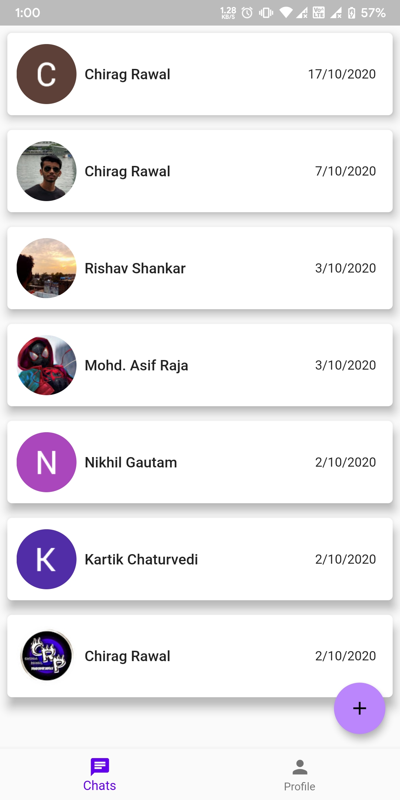
    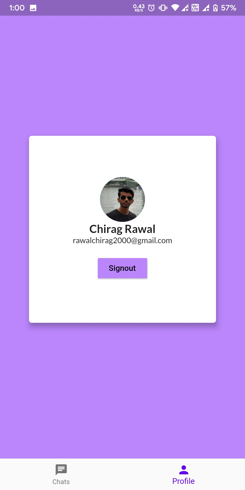
    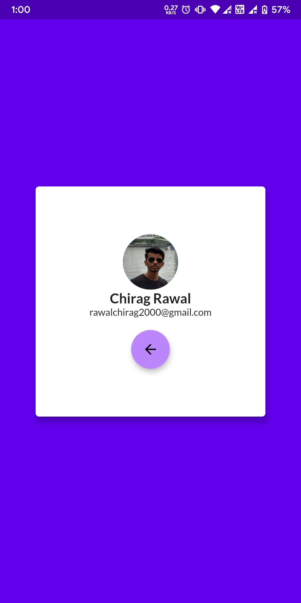
    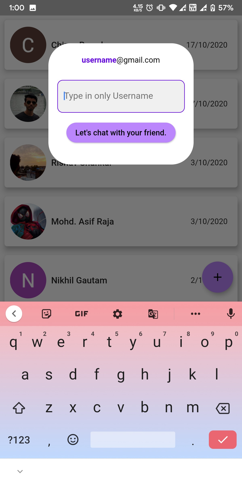
</p>
<p float="left">
    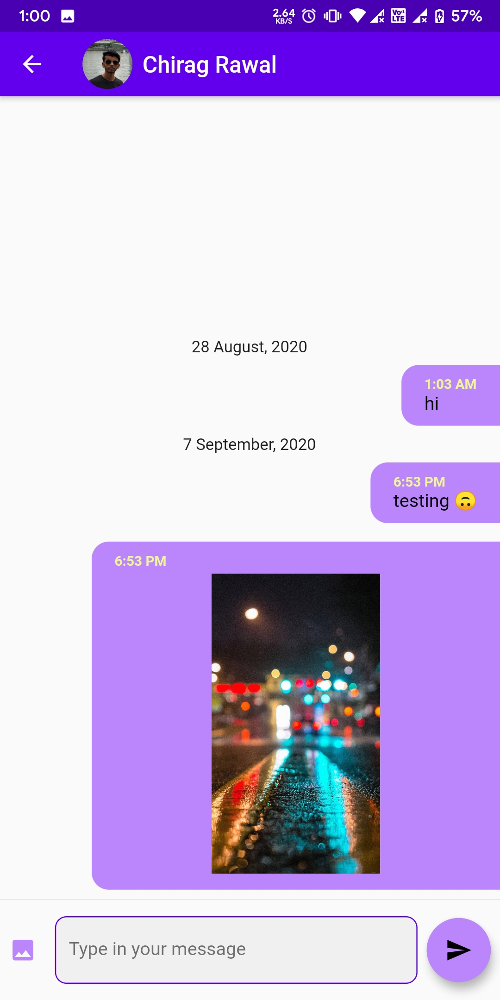
    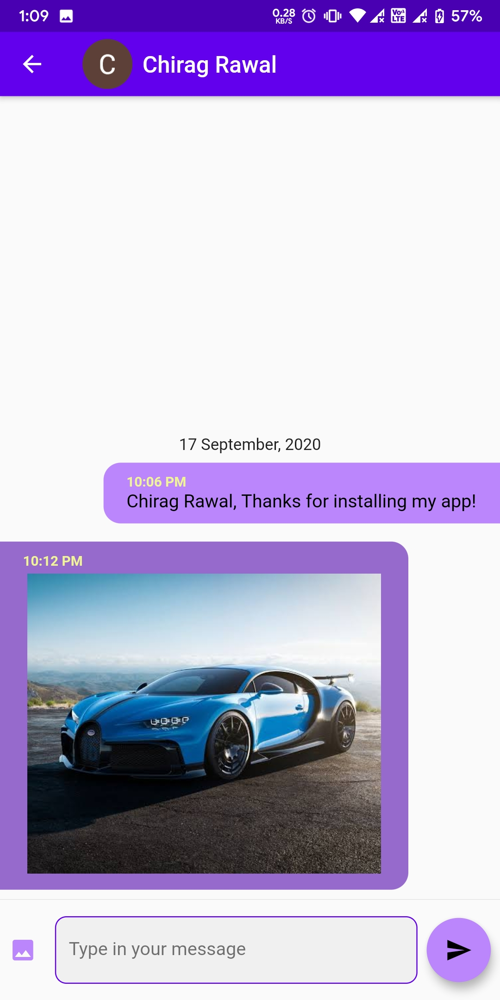
    
    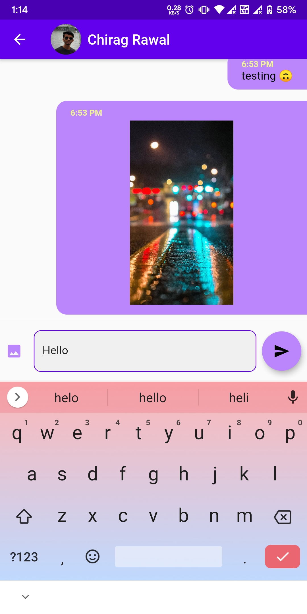
</p>
<p float="left">
    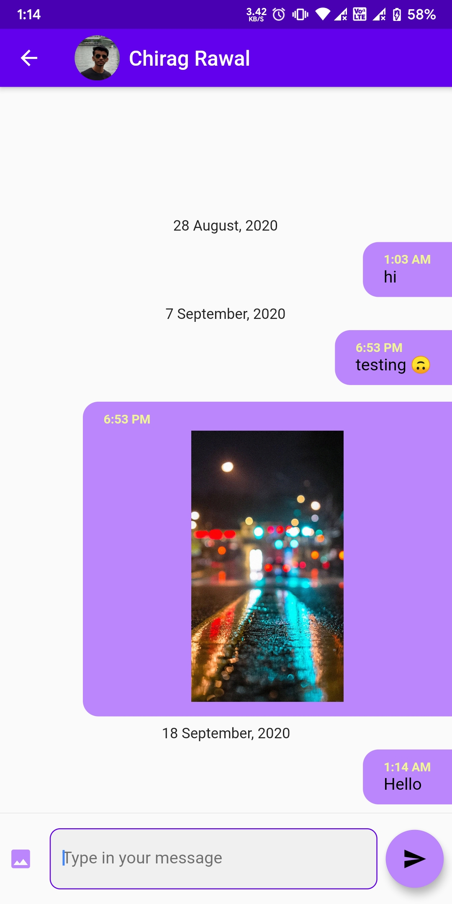
    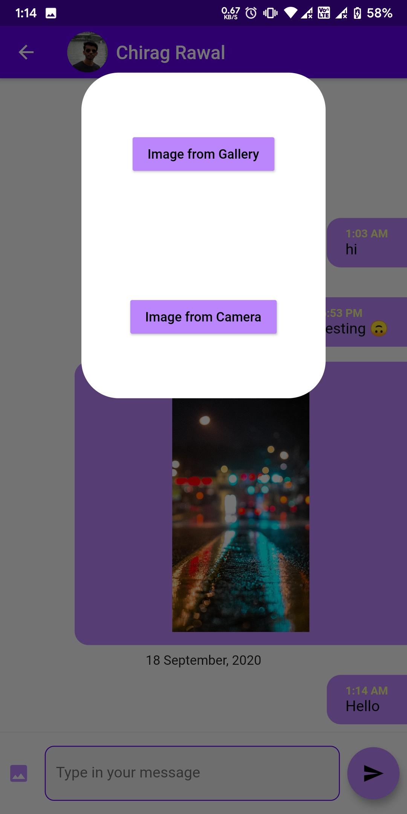
    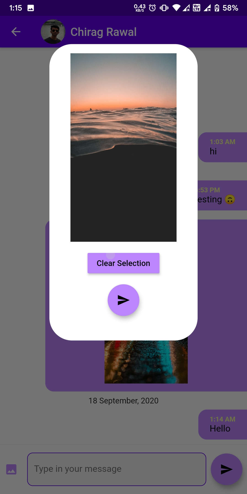
    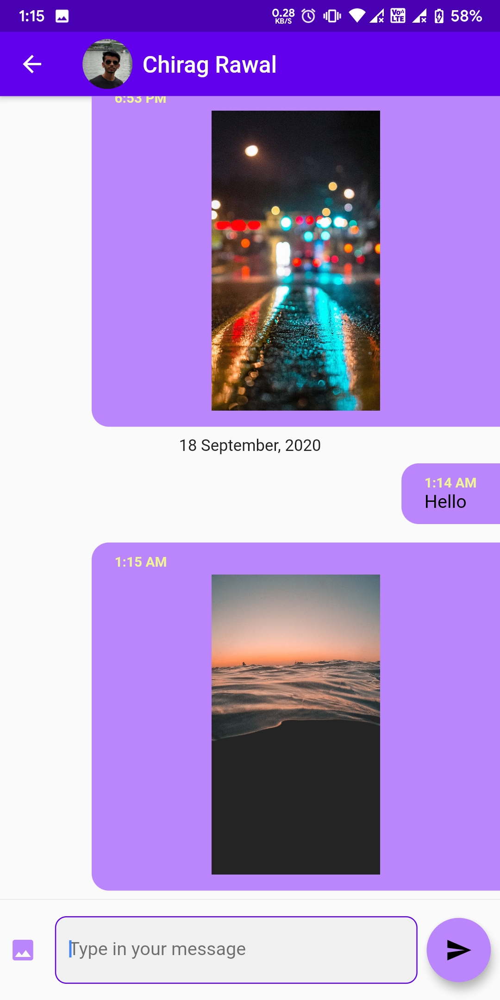
</p>

---
## Note
    This project is still under development.

---
## Tasks / ToDo
- [ ]  Screens
    - [x]  Chat Screen
        - [x]  Chats List
        - [x]  Chats UI
        - [x]  Other User Profile
        - [x]  Image Support in chat
        - [x]  Add Friend option
    - [x]  Profile Screen
    - [ ]  Settings for the app

- [x]  Online Fetching
    - [x]  Chats List
    - [x]  Chats Live
    - [x]  User Data

- [x]  Design Firebase Firestore
    - [x]  Chat Rooms
    - [x]  User Data

- [ ]  Offline Storage
    - [x]  User Info in SharedPreference
        - [x]  getter
        - [x]  setter
    - [ ]  Chat Offline Storage

- [ ]  Additional Feats
    - [ ]  Local Notifications
    - [ ]  Encryption for security (End-to-End)
    - [x]  Greetings message for new Users using Firebase Functions

---
## Created & Maintained by 
[Chirag Rawal](https://chirag.design) <-> [hackrhive](https://github.com/hackrhive)

---
## LICENCE
```
MIT License

Copyright (c) 2020 Chirag Rawal

Permission is hereby granted, free of charge, to any person obtaining a copy
of this software and associated documentation files (the "Software"), to deal
in the Software without restriction, including without limitation the rights
to use, copy, modify, merge, publish, distribute, sublicense, and/or sell
copies of the Software, and to permit persons to whom the Software is
furnished to do so, subject to the following conditions:

The above copyright notice and this permission notice shall be included in all
copies or substantial portions of the Software.

THE SOFTWARE IS PROVIDED "AS IS", WITHOUT WARRANTY OF ANY KIND, EXPRESS OR
IMPLIED, INCLUDING BUT NOT LIMITED TO THE WARRANTIES OF MERCHANTABILITY,
FITNESS FOR A PARTICULAR PURPOSE AND NONINFRINGEMENT. IN NO EVENT SHALL THE
AUTHORS OR COPYRIGHT HOLDERS BE LIABLE FOR ANY CLAIM, DAMAGES OR OTHER
LIABILITY, WHETHER IN AN ACTION OF CONTRACT, TORT OR OTHERWISE, ARISING FROM,
OUT OF OR IN CONNECTION WITH THE SOFTWARE OR THE USE OR OTHER DEALINGS IN THE
SOFTWARE.
```